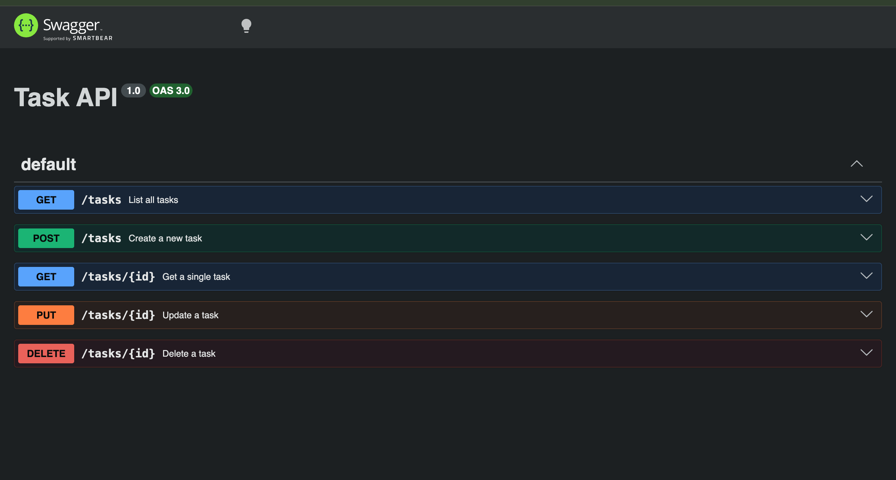

# Task API

A minimal CRUD API for managing a to-do list. Built with Express, in-memory storage (no database — data resets on restart).

## Run it

```bash
npm install
node server.js
```

Server runs on `http://localhost:3000`.

## Endpoints

| Method | Path          | Description              |
|--------|---------------|---------------------------|
| GET    | /             | API info                  |
| GET    | /health       | Health check               |
| GET    | /tasks        | List all tasks             |
| GET    | /tasks/:id    | Get a single task          |
| POST   | /tasks        | Create a new task          |
| PUT    | /tasks/:id    | Update a task               |
| DELETE | /tasks/:id    | Delete a task                |

## Swagger UI

Interactive docs available at `http://localhost:3000/docs` once the server is running.



## Example request

​```
curl -i http://localhost:3000/tasks
​```

Response:

​```
HTTP/1.1 200 OK
Content-Type: application/json; charset=utf-8

[{"id":1,"title":"Buy oat milk","done":false},{"id":2,"title":"Walk the dog","done":true}]
​```
## AI vs me

### My prompt

You're a Senior Backend Engineer at Google, build a CRUD API endpoint that will include five endpoints in five different steps.

1. GET  list all task
2. POST create a new task
3. GET a single task
3. PUT update a task
4. DELETE a task

Also add a swagger ui

Pick any language/framework you're comfortable with and use throughout this assignment, no change mid-way.
Make sure you get a status response of 200, 201 on create, or 404 on missing task.
Title is also required.

### What the AI did better

FastAPI generates Swagger UI automatically at /docs with zero extra code. My Express version needed a separate swagger-ui-express install and a hand-written openapi.json spec file. The AI's input validation is also declarative through Pydantic models rather than manual if checks, which means less code and less room for me to miss a case.

### What it got wrong or silently ignored

- I said status 400 for a missing title, it returned 422 instead, because that is FastAPI's default validation behavior and I never told it to override that.
- I never specified the DELETE status code, so it defaulted to 200 instead of the 204 I used, and returned a body instead of an empty one.
- I never specified the task's fields, so it invented description and completed instead of matching my done field, and used UUID ids instead of incrementing integers.
- It did not seed any example data on startup, so /tasks starts empty. My version pre-loads 3 tasks.

### What my prompt forgot to specify, and what the AI silently decided for me

I never said in-memory, no database explicitly, and got lucky that it chose in-memory anyway. I never specified the task object's shape, the DELETE status code, or the exact status code for validation failures. Every one of those gaps got filled by the framework's defaults rather than my intent. That is the actual lesson here: a spec is only as tight as what you write down, not what you assume is obvious.