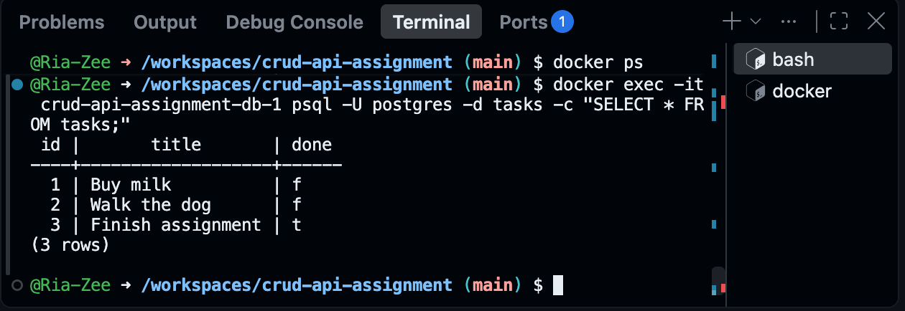
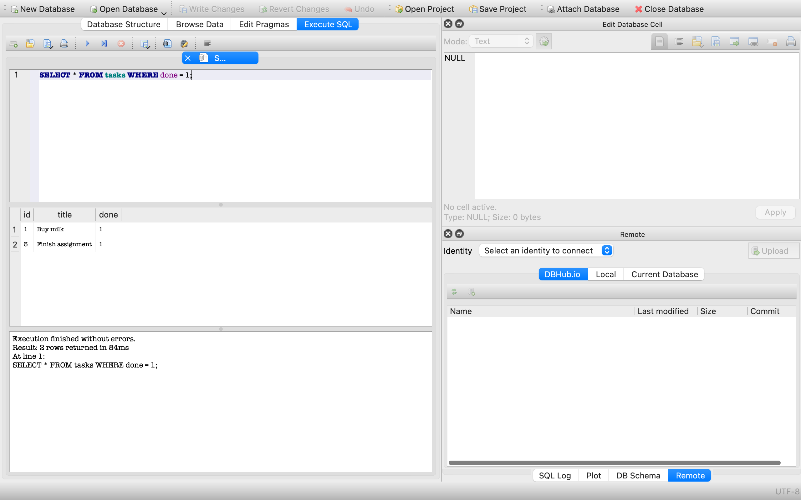

# Task API

A minimal CRUD API for managing a to-do list. Built with Express, backed by PostgreSQL running in Docker.

## Run it

One command starts the whole stack — the app and its Postgres database, both in Docker:

```bash
cp .env.example .env
docker compose up
```

Server runs on `http://localhost:3000`.

### Environment variables

`DATABASE_URL` — the Postgres connection string. See `.env.example`. Note: when running via `docker compose up`, the app reaches Postgres through the internal service name `db`, not `localhost` — that value is already set inside `compose.yaml` and does not read from `.env`. The `.env` file only matters if you run the app directly with `node --env-file=.env server.js` against a hand-run Postgres container (see below).

### Running without Docker Compose

```bash
docker run --name taskdb -e POSTGRES_PASSWORD=dev -e POSTGRES_DB=tasks \
  -p 5432:5432 -v taskdata:/var/lib/postgresql/data -d postgres:16
npm install
node --env-file=.env server.js
```

## Endpoints

| Method | Path          | Description              |
|--------|---------------|---------------------------|
| GET    | /             | API info                  |
| GET    | /health       | Health check               |
| GET    | /tasks        | List all tasks             |
| GET    | /tasks/:id    | Get a single task          |
| POST   | /tasks        | Create a new task          |
| PUT    | /tasks/:id    | Update a task               |
| DELETE | /tasks/:id    | Delete a task                |

## Swagger UI

Interactive docs available at `http://localhost:3000/docs` once the server is running.

## Database — Week 3 (Postgres + Docker)

This project now stores tasks in PostgreSQL, running in a Docker container, using the `pg` driver. All database logic lives in `db.js`, kept separate from the routes in `server.js`.

**Why Postgres:** it's a real database server, the same engine behind most production backends, not a single file like SQLite. Running it in Docker means no local install, no version conflicts, and the exact same container runs on any machine.

**Where the database lives:** inside the `db` container defined in `compose.yaml`, backed by a named Docker volume (`taskdata`) so data survives a full `docker compose down` and `up`.

**Confirmed via psql:**

    docker exec -it taskdb psql -U postgres -d tasks -c "SELECT * FROM tasks;"

    id |       title       | done
    ----+-------------------+------
      1 | Buy milk          | f
      2 | Walk the dog      | f
      3 | Finish assignment | t
    (3 rows)

**Database screenshot:**



**Persistence confirmed:** created a task via `POST /tasks`, ran `docker compose down` then `docker compose up`, and the task was still there — the volume, not the container, holds the data.

## Database — Week 2 (SQLite)

This project stores tasks in SQLite instead of memory, using `better-sqlite3`.

**Why SQLite:** it's a single file, no server to install or run, and zero configuration — perfect for a project this size, and it means data survives a server restart.

**Where the database lives:** `tasks.db`, created automatically the first time the server starts. It's git-ignored, so every clone of this repo starts with its own fresh, auto-seeded database rather than inheriting mine.

**Run it:**

```
npm install
node server.js
```

The `tasks` table and 3 example tasks are created automatically on first run.

**Database browser:**



**Example query run by hand in DB Browser:**

```
SELECT * FROM tasks WHERE done = 1;
```

Before marking "Buy milk" as done, this returned 1 row (just "Finish assignment"). After updating task 1's `done` field to 1 directly in DB Browser, re-running the same query returned 2 rows — and calling `GET /tasks` through the API immediately reflected the change, with no restart needed. That's the whole point: the API and DB Browser read the exact same file, so there's nothing to keep in sync.


## Example request

​```
curl -i http://localhost:3000/tasks
​```

Response:

​```
HTTP/1.1 200 OK
Content-Type: application/json; charset=utf-8

[{"id":1,"title":"Buy oat milk","done":false},{"id":2,"title":"Walk the dog","done":true}]
​```
## AI vs me

### My prompt

You're a Senior Backend Engineer at Google, build a CRUD API endpoint that will include five endpoints in five different steps.

1. GET  list all task
2. POST create a new task
3. GET a single task
3. PUT update a task
4. DELETE a task

Also add a swagger ui

Pick any language/framework you're comfortable with and use throughout this assignment, no change mid-way.
Make sure you get a status response of 200, 201 on create, or 404 on missing task.
Title is also required.

### What the AI did better

FastAPI generates Swagger UI automatically at /docs with zero extra code. My Express version needed a separate swagger-ui-express install and a hand-written openapi.json spec file. The AI's input validation is also declarative through Pydantic models rather than manual if checks, which means less code and less room for me to miss a case.

### What it got wrong or silently ignored

- I said status 400 for a missing title, it returned 422 instead, because that is FastAPI's default validation behavior and I never told it to override that.
- I never specified the DELETE status code, so it defaulted to 200 instead of the 204 I used, and returned a body instead of an empty one.
- I never specified the task's fields, so it invented description and completed instead of matching my done field, and used UUID ids instead of incrementing integers.
- It did not seed any example data on startup, so /tasks starts empty. My version pre-loads 3 tasks.

### What my prompt forgot to specify, and what the AI silently decided for me

I never said in-memory, no database explicitly, and got lucky that it chose in-memory anyway. I never specified the task object's shape, the DELETE status code, or the exact status code for validation failures. Every one of those gaps got filled by the framework's defaults rather than my intent. That is the actual lesson here: a spec is only as tight as what you write down, not what you assume is obvious.

## AI vs me — Week 2 (SQLite migration)

### My prompt

You're a Senior Backend Engineer, Migrate an in-memory CRUD task API TO SQLite following this 5 steps:
Step 0: Create a database, and confirm with 3 restarts using SQLite + better-sqlite3
Step 1: Read endpoints wired to the sql and tested
Step 2: Run a persistence test with POST wired to SQL
Step 3: Confirm full CRUD cycle with PUT/DELETE wired to SQL
Step 4: install the DB Browser, run raw SQL by hand and confirm the API and DB Browser share the same output or read each other
Step 5: Update README with why-SQLite(if used), with screenshot and example query and push to Github

Note:
Keep the existing API behaviour identical. Only the storage changes, not the routes.
Parameterise queries for safety
For the tasks.db, tables's columns should be; id, title, done
Maintain success status code as 200 and 400/404 for error or empty

### What the AI did better

It wrote a real automated test suite (`test/run-tests.js`) that spawns the actual server as a subprocess, hits it with real HTTP requests, kills the process, restarts it fresh, and checks the data survived. That's a stronger persistence check than my manual curl-and-restart routine. It also added a `CHECK (done IN (0,1))` constraint at the database level, `journal_mode = WAL` for safer concurrent access, validation on `id` (must be a valid integer) and `done` (must be a boolean), and a catch-all handler for malformed JSON and unexpected errors — none of which my version has. Its README's "why SQLite" section also names the tradeoff honestly: SQLite serializes writes, fine for one instance, wrong choice once you need multiple app servers writing to the same database.

### What it got wrong or silently ignored

I told it to "maintain success status code as 200" for everything. It didn't fully follow that: POST returns 201 and DELETE returns 204, both correct REST convention, but not what I literally asked for. It also couldn't install Express in its sandbox (no network access), so instead of just swapping the storage layer like I asked, it rewrote the whole request-handling layer using Node's built-in `http` module — a structural change to my API, not a storage-only change, even though my prompt explicitly said "only the storage changes, not the routes."

### What my prompt forgot to specify, and what the AI silently decided for me

I never said whether `done` should come back as `0`/`1` or `true`/`false` in API responses. It chose `true`/`false`, which is arguably cleaner than my version, which returns raw `0`/`1`. I also didn't specify what to do if Express wasn't available, so when its sandbox couldn't install it, the AI made a significant architectural decision on its own (drop Express entirely) rather than flagging it as a blocker.

### A false negative worth noting

The first time I ran the AI's test suite, 6 of 11 assertions failed. The cause wasn't the AI's code, it was a port collision: my own Week 2/3 server was still running on port 3000 while the test tried to spawn its own server on the same port, so the tests were silently hitting the wrong server the whole time. After stopping my server and rerunning in isolation, all 11 assertions passed. Lesson: a failing test isn't proof of a bug until you've confirmed what it actually tested.

## AI vs me — Week 3 (Postgres + Docker)

### My prompt

You're a Senior Backend Engineer. Containerize your CRUD API Database following these stages;

Stage 0: Use Postgres with one command and install Docker Desktop. Confirm the docker inside the container, the Add .gitignore with .env before you commit.

Stage 1: Connect and create the tasks table (id, title, done) if missing, seed 3 tasks only if empty. Create .env and .env.example file, then install pg driver. Note: "Never hardcode the password".

Stage 2: Read from Postgres and swap GET /tasks and GET /tasks/:id to real Postgres queries using $1 parameterized placeholders. Use these status code; PUT returns 200 with updated row, 201 for created, 204 for DELETE returns, 400 for missing/empty title and 404 for unknown id.

Stage 3: Create, update, delete. POST uses INSERT. Use the same status code as stage 2

Stage 4: Write a Dockerfile for your app, then a compose.yaml with two services (api + db). Inside compose, your app reaches Postgres via the service name db for volume use Postgres's data directory, not local host. Stop your hand-run container, run docker compose up then down thrice to confirm if data survives.

Stage 5: Publish and push to github

### What the AI did better

It added a `healthcheck` on the `db` service (`pg_isready`) and made `api` depend on `condition: service_healthy` instead of a plain `depends_on`. This is a real fix for a problem I actually hit: my own stack uses `restart: on-failure`, so on a cold start my `api` container crashes with `ECONNREFUSED` and retries until Postgres is ready. The AI's version waits until Postgres genuinely reports ready before starting `api` at all, no crash-loop, no error in the logs. It's strictly the better solution, and it's literally listed as a stretch goal in the assignment brief that I didn't attempt.

It also wrapped every route in try/catch with a 500 fallback, which mine doesn't have, and its `db.js` fails loudly on startup if any required env var is missing, instead of failing silently later. Its `Dockerfile` uses `node:20-alpine` for a smaller image and `npm install --omit=dev`, both reasonable defaults I didn't specify.

### What it got wrong or silently ignored

Its `server.js` calls `init()` inside the `app.listen()` callback, meaning the server starts accepting connections before the table is guaranteed to exist. A request landing in that window would hit a query against a table that isn't there yet. My version calls `init()` first and only starts listening once it succeeds, which is safer and matches what the assignment's own Stage 1 checkpoint tests for.

It also dropped my `/` and `/health` routes entirely, despite its own write-up specifically flagging that a health endpoint matters for orchestrators, it didn't build one anyway. And its PUT route requires `title` on every request; sending only `{"done": true}` gets rejected with 400. My version supports partial updates, falling back to the existing value for any field not sent.

It also generated an empty .env.example file. My prompt explicitly said "Create .env and .env.example file," and its own summary claimed this was done ("Copy .env.example to .env... .env.example is not [gitignored]"), but the actual file has no content. Given its db.js uses five discrete env vars instead of a single DATABASE_URL, an empty .env.example means a stranger cloning this AI-generated version wouldn't know what values to set without reading db.js first — the exact kind of self-documenting gap the assignment brief is testing for.

### What my prompt forgot to specify, and what the AI silently decided for me

I never said whether PUT should require a full replacement or allow partial updates. The AI picked the stricter interpretation without flagging it as a decision.

I also never specified the connection string format. My own `db.js` uses a single `DATABASE_URL`. The AI's `db.js` uses five discrete env vars (`PGHOST`, `PGPORT`, `PGUSER`, `PGPASSWORD`, `PGDATABASE`) instead. Neither is wrong, but they're incompatible: I couldn't drop the AI's `db.js` into my own `compose.yaml` without also rewriting my `.env` and `.env.example` to match its convention.

### One rematch

I regenerated with two additions: specifying `DATABASE_URL` as a single connection string in the same format my own `db.js` uses, and requiring PUT to support partial updates (only a title that is present and empty should 400). Both landed correctly. The new `db.js` uses `connectionString: process.env.DATABASE_URL`, matching my setup exactly, and the new PUT route uses `COALESCE($1, title)` in the SQL itself combined with `hasOwnProperty` checks, so an omitted field keeps its value and an explicitly-sent `null` is handled distinctly from an omitted one, a case my own prompt never asked about. The `init()`-after-`listen()` bug from the first run is still there, unchanged, since I didn't ask it to fix that, confirming the rematch was a targeted fix, not a full regeneration.