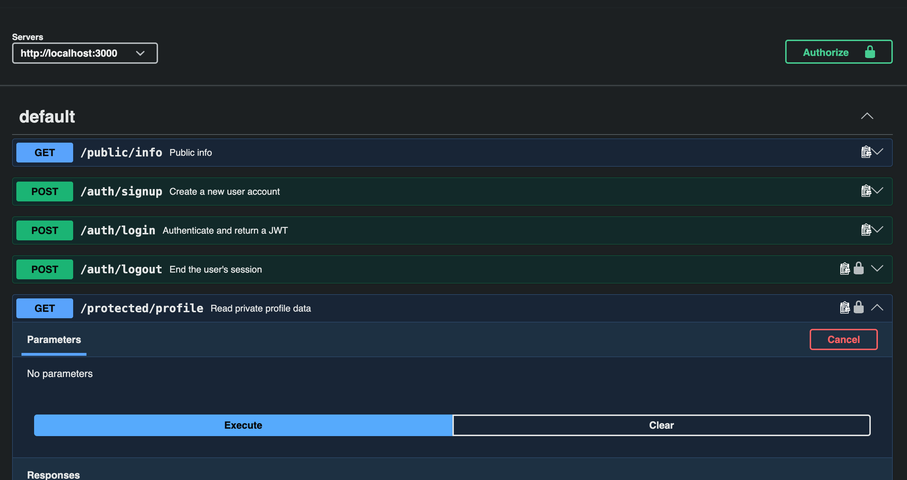

# Auth API

A secured API with sign up, log in, log out, and protected routes, backed by [Neon Auth](https://neon.tech/docs/auth/overview) (managed Better Auth). Built with Express and verified with JWKS-based JWT verification.

## Setup

1. Create a free [Neon](https://neon.tech) project and enable Neon Auth on it (Console → Auth → toggle on).
2. Copy `.env.example` to `.env` and fill in your own `AUTH_URL` and `JWKS_URL` from Neon's Console → Auth → Configuration tab:

```bash
cp .env.example .env
```

3. Install dependencies:

```bash
npm install
```

## Run it

```bash
node server.js
```

Server runs on `http://localhost:3000`.

## Endpoints

| Method | Path                  | Description                  | Auth required |
|--------|------------------------|-------------------------------|----------------|
| GET    | /public/info           | Public, open data              | No              |
| POST   | /auth/signup            | Create a new user account       | No              |
| POST   | /auth/login              | Authenticate & return a JWT      | No              |
| GET    | /protected/profile        | Read private profile data         | Yes — `Authorization: Bearer <token>` |
| GET    | /protected/dashboard       | Read protected dashboard data      | Yes — `Authorization: Bearer <token>` |
| POST   | /auth/logout              | End the user's session            | Yes — `Authorization: Bearer <token>` |

All error responses return a JSON body: `{ "error": "..." }`.

## Swagger UI

Interactive docs, with a bearer-token "Authorize" padlock, available at `http://localhost:3000/docs` once the server is running.



## Neon Auth vs Supabase — what actually differed

The assignment brief is written around Supabase Auth. This project uses Neon Auth instead (staff-approved substitution — see Stage 7 for the AI comparison this enabled). A few real, non-obvious differences surfaced while building this that are worth documenting, since they're not just implementation trivia — they shaped how the auth flow had to be built:

- **An `Origin` header is required on every server-to-server call.** Neon Auth's underlying Better Auth engine rejects requests without one, even from a backend that isn't a browser. Fixed by setting a default `Origin` header in `auth.js`'s `fetchOptions`.

- **Signup requires a `name` field.** Supabase's `signUp()` only needs email and password; Neon Auth's `signUp.email()` throws without a `name`. This API's `/auth/signup` route still only requires email and password from the client — it derives a default name from the email address if none is sent, so the public contract matches the brief's spec.

- **The JWT plugin isn't exposed through Neon's managed console.** Supabase's `getUser(token)` is a single call. Neon Auth's dedicated `/token` endpoint (via `authClient.token()`) isn't available on managed projects, and there's no toggle for it under Auth → Plugins. Instead, this API verifies the JWT that's already embedded inside `session.token` — returned from a cookie-based `getSession()` call — against Neon's public JWKS endpoint, using the `jose` library. This is arguably a *more* standard verification pattern (real signature check) than a live network round-trip, and it's the pattern the brief's `/protected/profile` checkpoint (tamper one character → 401) is built to test either way.

- **The session cookie's name and format took direct reverse-engineering.** Neon Auth's actual cookie is `__Secure-neon-auth.session_token`, and its value includes a URL-encoded HMAC signature suffix that isn't documented anywhere obvious. This was found by logging the raw `Set-Cookie` header from a real login response rather than guessing at Better Auth's generic defaults.

- **Logout's actual server-side effect is unverifiable from the client.** `POST /auth/logout` returns `204` and doesn't throw, but there's no way to confirm from outside Neon's dashboard whether the session was actually revoked, or whether the call quietly no-op'd. This is left as an open, honestly-flagged gap rather than a claimed guarantee — and it overlaps with the brief's own optional extra on why "instant logout" is genuinely hard with stateless JWTs.

## Example request

```
curl -i -X POST http://localhost:3000/auth/signup \
  -H "Content-Type: application/json" \
  -d '{"email":"test@example.com","password":"password123"}'
```

Response:

```
HTTP/1.1 201 Created
Content-Type: application/json; charset=utf-8

{"token":"...","user":{"name":"test","email":"test@example.com", ...}}
```

## AI vs me — Stage 7 (auth rematch)

### My prompt

You're a Senior Backend Engineer. Build a secure API that handles user authentication (Sign Up, Log In, and Log Out) and protects specific routes. You will use Node/Express lane and framework. You will use Neon Auth to manage user accounts, issue secure JSON Web Tokens (JWTs), and verify those tokens to protect "admin-only" or "user-only" API endpoints. You will test and document this flow in Swagger UI and publish your code to GitHub.

1. Sign Up / Log In: The client sends credentials (email and password) directly to Neon Auth.
2. The Token: Neon Auth validates the credentials and returns a JWT (Access Token).
3. The Request: The client sends a request to your backend server, attaching the JWT inside an Authorization Header
4. Verification: Your backend server decodes and verifies the JWT via a live call to the provider. If the token is valid, your server opens the protected door and sends the response.

Also provide proof of reusable middleware — a second protected route using the same guard function, no new auth code.

Follow these five routes; Signup, login, logout, public/info, protected/profile

Status Code will be;
201 for created
200 for success ok
204 for no content/empty
return 400 missing/empty email/password validation
401 for unauthorized/invalid or expired token

### What the AI did better

It added `helmet` for a full set of security response headers (CSP, X-Frame-Options, HSTS, etc.), which my own implementation doesn't have. Its JWT verification checks the `iss` claim against the Neon Auth base URL; mine only checks the signature. It mounts the auth guard once at the router level (`router.use(verifyToken)`) so both protected routes inherit it automatically, rather than passing the middleware into each route individually like mine does. It also creates a fresh Neon Auth client per request rather than one shared client for the server's lifetime, reasoning in a code comment that a shared client could leak one user's session state into another user's request on a multi-tenant backend — a concurrency concern I never tested for in my own version. Its 401 responses on invalid tokens include a `reason` field with the specific JWT verification error code, which is more useful for debugging than my generic message (though it's also a small amount of extra information handed to anyone probing the endpoint).

### What it got wrong or silently ignored

Three real bugs, all confirmed by actually running the generated code, not by reading it:

- **A hallucinated package version.** `package.json` specified `@neondatabase/auth@^0.3.0`, which doesn't exist on npm — the real latest version is `0.5.0-beta`. This blocked `npm install` entirely until I corrected it by hand.
- **No `Origin` header on outgoing requests**, despite my prompt explicitly describing a live call to the provider. The very first signup attempt crashed the entire server with an uncaught `AuthApiError: Origin header is required` — the exact issue I hit myself in Stage 1, but the AI had no way to know that without being told, since my original prompt didn't mention it.
- **Read `data.session.token` instead of `data.token`.** The real response shape from `signIn.email()`/`signUp.email()` is `{ token, user }`, confirmed repeatedly against my own working server — there is no nested `session` object. In the signup route this failed silently: optional chaining (`data.session?.token`) meant the response still came back `201 Created` but with `token: null`, no error shown anywhere. In the login route, the same access without optional chaining (`data.session.token`) threw an uncaught `TypeError` and crashed the server outright on every login attempt.

### What my prompt forgot to specify, and what the AI silently decided for me

I never told it that `signUp.email()` requires a `name` field — the same gap in my own first prompt back in Stage 1. It correctly guessed a sensible default (`name || email.split("@")[0]`), the identical workaround I built myself, without me ever mentioning that requirement existed. I also asked for verification "via a live call to the provider," which it satisfied by fetching Neon Auth's JWKS public keys (network call, cached) and verifying the JWT signature locally — a defensible reading of "live call," but not a literal per-request round-trip like Supabase's `getUser(token)`. It documented this interpretation directly in a code comment rather than silently picking one, which I think is the right way to handle a genuinely ambiguous instruction.

### One rematch

I regenerated with two specific corrections: telling it the real response shape is `{ token, user }` with no nested `session` object, and that every outgoing call needs an explicit `Origin` header matching the server's own URL. Both landed correctly and were confirmed by actually re-running the code: signup and login both now return real, usable tokens instead of `null` or a server crash. The rematch was targeted, not a full regeneration — the unrelated package-version bug, which I deliberately didn't mention in the rematch prompt, was still present afterward, confirming the fix only touched what was actually asked for.